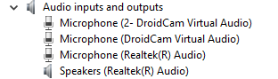

# Reinstalling sound devices Drivers

## Method 1: Windows Update

> This method will check for all updates in this system. sometimes this could fix a driver's problem
1. Open the Settings app. You can do this by clicking Start menu, pressing pressing the Settings icon above the power button.

   

2. Then you will see the windows10 default windows screen (windows8 will have the same method [find the option in the sidebar]).

   

3. click into "windows update" and select check for updates

   
4. Windows will check any available updates. if your sound driver is available to update windows will automatically update it. ( a restart will be required)

## Method 2: Device Manager

> This method may not work effectively on older versions of Windows, if this is the case then use method 3.

1. Open Device Manager by either searching for it in Start, or pressing <kbd>Win</kbd> + <kbd>R</kbd> and type <kbd>devmgmt.msc</kbd> afterwards.

   

2. Find and expand the "audio inputs and outputs" icon. You'll find a list of the sound devices in your system. There will usually be only one or two.

   

3. Right-click the adapter you wish to reinstall the sound devices for and right-click it. select poperties and Driver Then, select "uninstall driver". if you have updated your driver before in a shot limit of time you can use roll back driver

   

4. Select "Delete the driver software for this device" then click "Uninstall". Note that your sound might not function after clicking this button.

   

5. Go to "Action", then select "Scan for hardware changes".

   

6. Go back to Display Adapters and find the graphics device you are attempting to reinstall. Note that it may now be called "Microsoft Basic Display Adapter". Right-click it and select "Update driver".

   

7. Windows will now begin installing the latest graphics driver it can find. Note this may take some time and your screen may flicker. Note that if you get a message claiming the latest drivers are already installed, attempt method 3.

## Method 3: OEM Website

> It is difficult to be precise with this method as hardware configurations and website layouts vary considerably. If you're unable to find the correct page for your drivers, searching "[device] graphics drivers" may help yield the correct results. Just make sure you're getting them from the manufacturer's website.
>
> Generic display drivers for most common adapters can be found here:
>
> - Intel: https://downloadcenter.intel.com/
> - NVIDIA: https://www.nvidia.com/Download/index.aspx
> - AMD: https://www.amd.com/en/support
>
> You may also want to use DDU for this if you're using an NVIDIA or Intel GPU. If that's the case, there is an excellent guide on that [here](https://www.wagnardsoft.com/content/ddu-guide-tutorial). If you're using an AMD GPU, then the Radeon installer's built-in "factory reset" (under Additional Options) function is preferred over DDU.

1. Open your web browser and navigate to the website of your device or graphics adapter's manufacturer. For example, if this is a Dell laptop then go to Dell's website, however if it's a custom-built desktop with an NVIDIA graphics card, then head to NVIDIA's website etc.

2. Locate the option for downloading drivers for your product. If it is a pre-built computer such as a laptop you may need to model or serial number to find the download page.

3. Find the download for the graphics drivers, agree to any terms and conditions, then download the file.

4. Run the downloaded executable file and follow the on-screen instructions.
