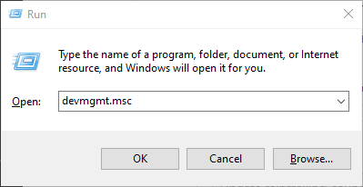

# Reinstalling sound Drivers

## Method 1: Windows Update

> This method will check for all updates in this system. sometimes this could fix a driver's problem
1. Open the Settings app. You can do this by clicking Start menu, pressing pressing the Settings icon above the power button.

   

2. Then you will see the windows10 default windows screen (windows8 will have the same method [find the option in the sidebar]).

   

3. click into "windows update" and select check for updates

   
4. Windows will check any available updates. if your sound driver is available to update windows will automatically update it. ( a restart will be required)
~~follow the installing gpu guide~~

## Method 2: intel driver and support assistant
> sometimes intel driver and support can update drivers as windows update might not have detected the driver update. They are as follow
https://www.intel.com.au/content/www/au/en/support/intel-driver-support-assistant.html
This assiastant will scan your PC for any intel drivers (including sound drivers if you have a intel one) and you can use this tool to download the update pack and install.

## Method 3: Device Manager

> This method may not work effectively on older versions of Windows, if this is the case then use method 3.

1. Open Device Manager by either searching for it in Start, or pressing <kbd>Win</kbd> + <kbd>R</kbd> and type <kbd>devmgmt.msc</kbd> afterwards.

   

2. Find and expand the "audio inputs and outputs" icon. You'll find a list of the sound devices in your system. There will usually be only one or two.

   

3. Right-click the adapter you wish to reinstall the sound devices for and right-click it. select poperties and Driver Then, select "uninstall driver". if you have updated your driver before in a shot limit of time you can use roll back driver

   

4. Select "Delete the driver software for this device" then click "Uninstall". Note that your sound might not function after clicking this button.

   

5. Go to "Action", then select "Scan for hardware changes".

   

6. Go back to audio inputs and outputs and find the sound device you are attempting to reinstall. Right-click it and select "Update driver".

   

7. Windows will now begin installing the latest graphics driver it can find. Note this may take some time and note that you might still not able to hear. Note that if you cant install the drivers head to  method 3.

## Method 4: OEM Website

> It is difficult to use with this method as there are lots of builds of the same driver and your pc might not work with all of them. If you're unable to find the correct page for your drivers, searching "realtek drivers [your os]" may help with the research. Just make sure you're getting them from the manufacturer's website.
>
> Generic display drivers for most common adapters can be found here:
>
> - realtek: https://realtek-download.com/download-hd/
>
8. after you have downloaded the exe/zip file run/unzip and run the file. <b>please give administrator</b>for installation.
Good Luck!
